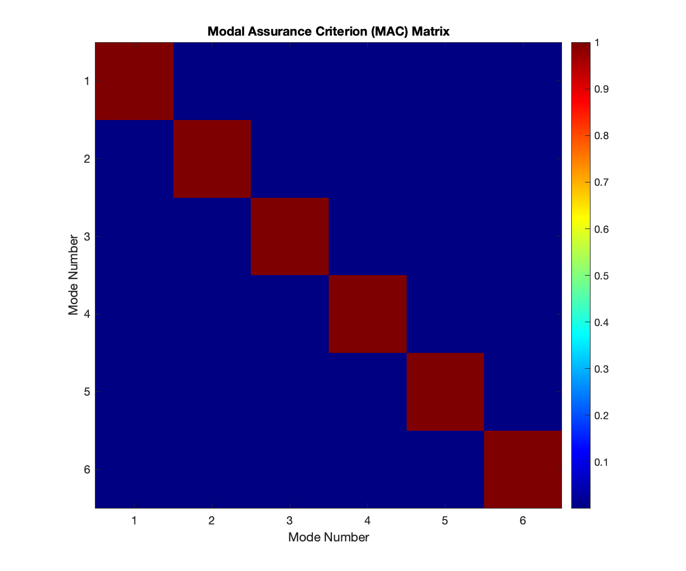

# Modal Analysis Package for Curved Surfaces

A comprehensive MATLAB package for modal analysis of curved surfaces, including spherical, ellipsoidal, cylindrical, and conical surfaces. The package supports advanced features such as multi-scale analysis, fluid-structure interaction, topology optimization, and progressive failure analysis.

## Results Gallery

### Modal Analysis


### Frequency Response Analysis


### Individual Mode Shapes
| Mode 1 (89.67 Hz) | Mode 2 (89.67 Hz) | Mode 3 (89.72 Hz) |
|-------------------|-------------------|-------------------|
|  |  |  |

| Mode 4 (89.72 Hz) | Mode 5 (89.81 Hz) | Mode 6 (89.81 Hz) |
|-------------------|-------------------|-------------------|
|  |  |  |

### Advanced Analysis Results

#### Comparative Modal Analysis

*Comparison of mode shapes between different surface types*

#### Composite Shell Analysis

*Modal analysis results for composite shell structures*

#### Dynamic Response Analysis

*Time-domain response under dynamic loading*

#### Frequency Analysis
| Frequency Response Function | MAC Matrix Analysis |
|----------------------------|---------------------|
|  |  |

#### Strain Energy Distribution

*Strain energy distribution during modal deformation*

#### Thermal Effects

*Thermal-structural coupling analysis results*

## Features

### Modal Analysis
- Natural frequencies and mode shapes computation
- Mass normalization and orthogonality checks
- Frequency response analysis
- Random vibration analysis

### Surface Types
- Spherical shells
- Ellipsoidal shells
- Cylindrical shells
- Conical shells
- Custom parametric surfaces

### Analysis Types
- Modal analysis
- Dynamic response
- Thermal-structural coupling
- Buckling analysis
- Fluid-structure interaction
- Topology optimization

## Installation

1. Clone the repository:
```bash
git clone https://github.com/gxingqiang/modal-analysis.git
```

2. Add the package to your MATLAB path:
```matlab
addpath('/path/to/modal-analysis');
```

## Quick Start

```matlab
% Create a cylindrical shell
params = struct('R', 0.3, 'L', 0.6, 't', 0.002);
shell = CurvedShellAnalysis.CylindricalSurface(params);

% Set material properties (Steel)
material = struct('E', 210e9, 'nu', 0.3, 'rho', 7800);
shell.setMaterial(material);

% Perform modal analysis
modal = CurvedShellAnalysis.ModalAnalysis(shell, 10);
modal.analyze();

% Plot mode shapes
modal.plotModes(1:4);
```

## Examples

Check out the demos folder for comprehensive examples:

1. `demo_modal_analysis.m`: Basic modal analysis
   - Natural frequencies and mode shapes
   - Frequency response functions
   - Dynamic response analysis

2. `demo_composite_shell.m`: Composite shell analysis
   - Laminate properties
   - Thermal effects
   - Progressive failure

3. `demo_fsi_analysis.m`: Fluid-structure interaction
   - Pressure fields
   - Flow-induced vibration
   - Flutter analysis

4. `demo_topology_optimization.m`: Shell optimization
   - Compliance minimization
   - Frequency constraints
   - Manufacturing constraints

## Documentation

- [Theory Manual](docs/theory_manual.md)
- [Advanced Examples](docs/advanced_examples.md)
- [API Reference](docs/api_reference.md)

## Contributing

Contributions are welcome! Please feel free to submit a Pull Request.

## License

This project is licensed under the MIT License - see the [LICENSE](LICENSE) file for details.

## Author

Xingqiang Chen

## Citation

If you use this package in your research, please cite:

```bibtex
@software{chen2024modal,
  author = {Chen, Xingqiang},
  title = {Modal Analysis Package for Curved Surfaces},
  year = {2024},
  publisher = {GitHub},
  url = {https://github.com/gxingqiang/modal-analysis}
}
```

## Contact

For questions and feedback:
- Email: chen.xingqiang@iechor.com
- GitHub Issues: [https://github.com/gxingqiang/modal-analysis/issues](https://github.com/gxingqiang/modal-analysis/issues)
